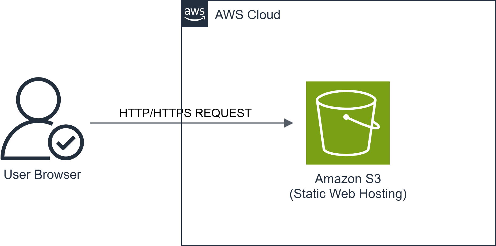

# Cloud-Native Portfolio Platform

## Overview
A personal portfolio application designed to evolve from static cloud hosting
into a fully automated, containerized, cloud-native system on AWS.

The project demonstrates hands-on cloud engineering skills through
incremental, production-style phases.

## Project Phases
- Phase 1: Static Website Hosting (S3)
- Phase 2: Serverless Backend (Lambda, API Gateway, DynamoDB)
- Phase 3: Containerized Backend (Docker, EC2, RDS)
- Phase 4: Infrastructure as Code (Terraform)
- Phase 5: Automation & Monitoring
- Phase 6: CI/CD Pipeline

Each phase builds on the previous one, following cloud engineering best practices.

## Documentation Index
- [Phase 1 – Static Hosting](site/README.md)
- [Phase 2 – Serverless Backend](serverless/README.md)
- [Phase 3 – Containerized Backend](docker/README.md)
- [Phase 4 - Terraform](terraform/README.md) 

## Repository Structure

cloud-native-portfolio/
├── site/              # Static frontend files
├── diagrams/          # Architecture diagrams
├── serverless/        # Serverless backend (Phase 2)
├── docker/            # Containerized services (Phase 3)
├── terraform/         # Infrastructure as Code (Phase 4)
├── scripts/           # Automation scripts
└── README.md

---

## Phase 1 – Static Website Hosting (AWS S3)

### Objective
Deploy a minimal, professional personal portfolio using AWS S3 static website
hosting, following cloud security and documentation best practices.

### Architecture

### AWS Services Used
- Amazon S3 (Static Website Hosting)
- AWS Identity and Access Management (IAM)

### Implementation Steps
1. Created a dedicated IAM user with least-privilege S3 access.
2. Created an S3 bucket configured for static website hosting.
3. Uploaded HTML and CSS files.
4. Applied a public-read bucket policy for website access.
5. Verified public access via the S3 website endpoint.

### Security Considerations
- Root account was not used for daily operations.
- IAM user followed least-privilege principles.
- Public access was restricted to website objects only.

### Outcome
A publicly accessible static portfolio website hosted on AWS S3, serving as the
frontend foundation for future cloud-native enhancements.

### Next Phase
Phase 2 will introduce a serverless backend using AWS Lambda, API Gateway, and DynamoDB.

## Phase 2 – Serverless Backend (AWS Lambda)
A serverless backend was added to the portfolio using AWS Lambda, API Gateway,
and DynamoDB to process and store contact form submissions.
