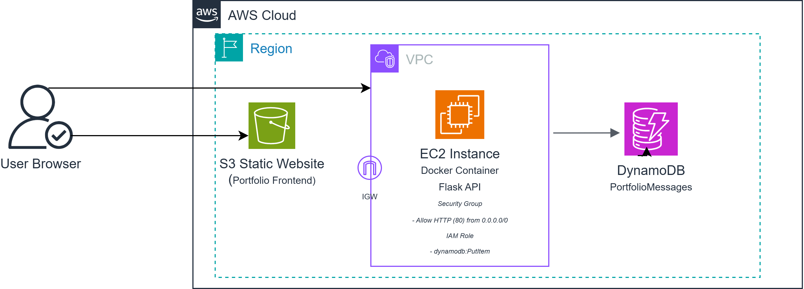

## Phase 3 – Containerized Backend (Docker + EC2)

### Objective
Containerize the backend API and deploy it on an Amazon EC2 instance,
demonstrating Docker fundamentals and compute management.

### Architecture

### AWS Services Used
- Amazon EC2
- IAM Role
- Amazon DynamoDB
- Docker

### Implementation Steps
1. Built a Flask API to handle contact form submissions.
2. Containerized the application using Docker.
3. Pushed the container image to EC2.
4. Assigned an IAM role to EC2 for DynamoDB access.
5. Exposed the API over HTTP.
6. Verified end-to-end communication from frontend to DynamoDB.

### Security Considerations
- No hardcoded AWS credentials.
- IAM role used for service-to-service authentication.
- EC2 security group restricted to required ports.

### Endpoints
- GET /health
- POST /contact

### Testing
- curl POST from EC2
- Browser form submission from S3
- DynamoDB item verification

### Outcome
A Dockerized backend successfully deployed on EC2, integrated with
a DynamoDB data store and serving production traffic.

### Next Phase
Phase 4 will introduce Infrastructure as Code using Terraform.
